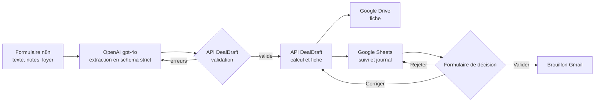

# DealDraft

**Collez une annonce. Recevez l'étude de rendement.**

DealDraft transforme une annonce immobilière, un message d'agent ou des notes de visite en brouillon d'étude de rendement chiffré, rangé dans Google Drive. Chaque valeur est reliée à la phrase dont elle vient, chaque montant est calculé par du code testé, et rien ne part chez le client sans votre validation.

[Site et démonstration](https://deal-draft-nu.vercel.app) | [Rapport d'évaluation](eval/report.md) | [Installation](#installation)

---

## Ce que fait DealDraft

1. **Vous collez le texte** dans un formulaire : annonce en ligne, message d'agent immobilier, notes de visite dictées. Vous ajoutez le loyer visé après travaux.
2. **DealDraft prépare l'étude** : prix, surface, occupation, état, travaux repérés, données manquantes, budget, rendement, durée de chantier. La fiche est créée dans Google Drive et ajoutée au tableau de suivi.
3. **Vous décidez** :
   - **Valider** crée un brouillon Gmail pour votre client ;
   - **Corriger** une hypothèse (loyer, frais de notaire) recalcule la fiche au même lien, sans relancer l'IA ;
   - **Rejeter** classe l'étude, avec votre remarque.

De l'envoi du formulaire à la fiche dans Drive, une étude prend environ 12 secondes en test.

## Pourquoi s'y fier

Une étude de rendement engage votre parole auprès d'un client. DealDraft est construit pour que l'IA ne puisse pas inventer un chiffre.

| Principe | Mise en œuvre |
|---|---|
| **L'IA lit, le code calcule** | Le modèle remplit un schéma JSON strict. Il ne fixe aucun prix, n'estime aucun loyer, n'additionne aucun montant. Budget, frais de notaire et rendement sortent de `finance.py`, couvert par des tests. |
| **Chaque valeur a sa source** | Pour chaque champ renseigné, le modèle cite la phrase d'origine. Le validateur vérifie que la citation existe mot pour mot dans le texte, sinon la réponse est renvoyée au modèle avec l'erreur (2 nouvelles tentatives au plus). |
| **Vide plutôt que deviné** | Une information absente du texte reste `null` et apparaît dans la liste des données à demander. |
| **Aucun prix sans source** | Chaque prix de la grille de travaux porte sa source. Un poste sans prix reste non chiffré et la fiche le signale. |
| **Rien ne part sans vous** | DealDraft crée des brouillons, jamais d'envoi. Une étude ne peut être validée qu'une fois. |
| **Le texte reçu reste une donnée** | Un message transféré qui contient des instructions est traité comme du contenu à analyser, jamais comme une consigne. Ce cas fait partie des tests. |

## Résultats mesurés

Évaluation sur 20 annonces et messages fictifs, dont des pièges : immeuble en plusieurs lots, fourchette de prix, loyer annuel, consigne cachée dans le texte. Les chiffres ci-dessous portent sur les 6 cas de test, mis de côté pendant la mise au point et vérifiés champ par champ par un ingénieur. Modèle `gpt-4o-2024-08-06`, 3 exécutions par cas.

| Critère | Objectif | Résultat |
|---|---|---|
| Valeurs justes (champs renseignés) | 90 % au moins | **98,5 %** (198 sur 201) |
| Valeurs inventées sur prix, surface, type, occupation, loyer, état | 0 | **0** |
| Citations retrouvées mot pour mot | 100 % | **100 %** (237 sur 237) |
| Réponse valide dès le premier essai | 95 % au moins | **100 %** (18 sur 18) |
| Pièges déjoués | tous | **3 sur 3** |
| Postes de travaux repérés | suivi | 79 % (45 sur 57) |
| Coût par étude | | 0,008 $ |

Sur les 60 lectures de `gpt-4o`, le budget et le rendement calculés à partir de l'extraction sont identiques à ceux calculés à partir de la réponse attendue. `gpt-4o-mini` a été écarté : seize fois moins cher, mais 9 valeurs inventées sur des champs critiques en 60 lectures.

Le calcul du rendement a été recoupé avec une étude publiée (studio de 32 m² à Saint-Étienne, annoncé à 13,5 %) : DealDraft obtient 13,50 %.

Méthode, erreurs trouvées et corrigées, limites : [eval/report.md](eval/report.md).

## Fonctionnement



| Couche | Choix |
|---|---|
| Orchestration | n8n auto-hébergé, version épinglée |
| Moteur métier | Python 3.12, FastAPI, Pydantic v2 |
| Lecture des textes | API OpenAI, `response_format` en `json_schema` strict |
| Données | Google Drive (fiches), Google Sheets (suivi et journal), Gmail (brouillons) |
| Déploiement | Docker Compose, ports ouverts sur `127.0.0.1` uniquement |

Le schéma envoyé au modèle est généré depuis les modèles Pydantic, jamais écrit à la main : le contrat vérifié par l'API et celui imposé au modèle ne peuvent pas diverger. Chaque fiche garde la trace du modèle, de la version du prompt et de la version du schéma utilisés.

Trois workflows n8n :

| Workflow | Rôle |
|---|---|
| `wf-ingest-listing` | Formulaire d'entrée, extraction, validation avec nouvelles tentatives, calcul, fiche, ligne de suivi |
| `wf-approve-and-draft` | Formulaire de décision : brouillon Gmail, recalcul avec nouvelles hypothèses, rejet |
| `wf-error-handler` | Journalise toute erreur d'exécution dans le Google Sheet |

Un quatrième, `wf-setup-google`, crée une fois pour toutes le dossier Drive et le Google Sheet.

## Installation

### Prérequis

- Docker et Docker Compose
- Node.js 20 ou plus (génération des workflows)
- Une clé API OpenAI
- Un compte Google avec un client OAuth (Drive, Docs, Sheets, Gmail)

### Étapes

```bash
# 1. Configuration
cp .env.example .env
# Renseigner N8N_VERSION (version exacte, jamais "latest") et N8N_ENCRYPTION_KEY :
openssl rand -hex 32

# 2. Démarrage
docker compose build api
docker compose up -d                  # API sur :8000, n8n sur :5678

# 3. Workflows
cp n8n/config.example.json n8n/config.local.json
docker compose exec n8n sh -c "node /n8n-repo/render-workflows.mjs && n8n import:workflow --separate --input=/n8n-repo/.rendered"
```

4. **Identifiants dans n8n** (`http://localhost:5678`) : créer les identifiants OpenAI, Google Docs, Google Sheets et Gmail, puis les sélectionner dans les nœuds qui les demandent.
5. **Espace Google** : exécuter `wf-setup-google` une fois. Reporter l'identifiant du dossier Drive et celui du Google Sheet dans `n8n/config.local.json`, avec l'adresse qui recevra les brouillons (`draftRecipient`).
6. **Réimport et publication** :

```bash
docker compose exec n8n sh -c "node /n8n-repo/render-workflows.mjs && n8n import:workflow --separate --input=/n8n-repo/.rendered"
docker compose exec n8n sh -c "for id in wfIngestListing01 wfApproveDraft01 wfErrorHandler01; do n8n publish:workflow --id=\$id; done"
docker compose restart n8n
```

Le formulaire d'entrée est alors disponible sur `http://localhost:5678/form/9c1f6f1e-6a0b-4a52-8d7a-2b6c1e5d1001`.

> Un client OAuth Google en mode test expire ses jetons au bout de 7 jours environ : reconnectez les identifiants Google dans n8n si les fiches ne se créent plus. En production, publiez l'application OAuth.

## Configuration

| Élément | Fichier | Contenu |
|---|---|---|
| Grille de prix des travaux | `pricing/works-grid.example.yaml` | Prix par poste (14 catégories) et prix au m² selon l'état du bien, chacun avec sa source. La grille fournie est un exemple au statut `illustrative`, affiché sur chaque fiche : remplacez-la par la vôtre. |
| Gabarit de la fiche | `api/app/templates/report.html.j2` | Rubriques, mentions, ordre des sections. |
| Libellés et formats | `api/app/localization.py` | Libellés français, format des nombres et des montants. |
| Espace Google | `n8n/config.local.json` | Dossier Drive, Google Sheet, destinataire des brouillons, URL publique de n8n. Fichier local, jamais commité. |

Hypothèses saisies à chaque étude : loyer mensuel visé après travaux, taux de frais de notaire, budget d'ameublement, financement. Aucune n'a de valeur par défaut : une valeur inconnue reste inconnue sur la fiche. Seuls deux paramètres ont un défaut documenté : un apport de 10 % et une vacance locative d'un mois par an.

La fiche affiche deux rendements bruts : sur la base achat, notaire, travaux et ameublement, et sur le budget total avec les autres frais. Choisissez celui qui correspond à votre pratique ; l'autre peut rester en information.

## API

| Méthode | Route | Rôle |
|---|---|---|
| `GET` | `/health` | État et version du schéma |
| `GET` | `/extraction-tool` | Schéma, prompt et versions |
| `POST` | `/extraction-request` | Requête OpenAI complète, partagée par n8n et l'évaluation |
| `POST` | `/validate-extraction` | Contrôle du schéma et des citations ; erreurs structurées en `422` |
| `POST` | `/analyze` | Calcul du budget, des rendements et de la durée de chantier |
| `POST` | `/report` | Calcul et fiche HTML |

Documentation interactive : `http://localhost:8000/docs`.

## Développement

```bash
docker compose run --rm api pytest                              # 188 tests
docker compose run --rm api python scripts/export_schema.py     # régénère schemas/ après une modification du contrat
node n8n/build-workflows.mjs                                    # régénère n8n/workflows/ après une modification du générateur
docker compose --profile eval run --rm eval python scripts/run_eval.py --split dev --runs 3
```

Règles du dépôt :

- les workflows se modifient dans `n8n/build-workflows.mjs`, pas dans l'éditeur n8n ;
- toute modification de `ListingExtraction` change la version du schéma : régénérer le schéma, mettre à jour `eval/ground_truth/` et repasser les tests ;
- chaque citation de la vérité terrain doit se retrouver mot pour mot dans le texte source (vérifié par les tests) ;
- `.env`, `n8n/config.local.json` et `eval/raw/` ne sont jamais commités.

La page de présentation (`web/`) est un site Next.js en export statique. Sa démonstration rejoue une vraie exécution, produite par `api/scripts/export_demo.py` puis copiée par `npm run syncDemo`.

## Structure

```
api/app/          moteur métier : schémas, prompt, validation, calcul, fiche
api/scripts/      export du schéma, évaluation, export de la démonstration
api/tests/        tests du contrat, de la grille, du calcul et de l'évaluation
pricing/          grille de prix des travaux
schemas/          schéma d'extraction généré
n8n/              générateur et workflows
eval/             jeu d'évaluation, vérité terrain, exécutions, rapport
web/              page de présentation
docs/             gabarit de la fiche
```

## Feuille de route

Ce que la version actuelle ne fait pas encore, et ce qui est prévu :

| Sujet | Aujourd'hui | Prochaine étape |
|---|---|---|
| Travaux de structure | Plancher affaissé ou fissure sur mur porteur parfois omis (rappel de 79 % sur les postes de travaux en test) | Règle dédiée dans le prompt, mesurée sur de nouveaux cas |
| Grille de prix | Grille d'exemple, la plupart des postes non chiffrés | Import de votre grille et suivi de ses versions |
| Identifiants n8n | À sélectionner à la main après import | Association automatique à l'installation |
| Formats d'entrée | Texte collé | Import de PDF d'annonce, transfert d'e-mail, photos de visite |
| Échantillon d'évaluation | 6 cas de test vérifiés | Jeu élargi avec de vraies annonces anonymisées |
| Temps gagné | Non mesuré | Mesure avec vos chasseurs, sur des dossiers réels |
| Hébergement | Un poste ou un serveur, accès local | Hébergement géré avec accès sécurisé pour l'équipe |

## À valider à la mise en service

DealDraft repose sur quelques choix qui doivent correspondre à votre façon de travailler :

1. **Définition du rendement** : loyer annuel divisé par achat, notaire, travaux et ameublement, ou par le budget total avec vos frais ? La fiche affiche les deux tant que ce n'est pas tranché.
2. **Écart entre budget annoncé et somme des postes** : honoraires, frais de dossier ou autres ? À reporter dans les autres frais.
3. **Arrivée des biens** : messages d'agents immobiliers et visites, annonces en ligne, ou les deux.
4. **Préparation actuelle des études** : à la main, dans un tableur, ou dans un outil existant à brancher.
5. **Loyer après travaux** : fixé par le chasseur, ou à partir de références internes à afficher à côté de la saisie.
6. **Grille de prix interne** : existe-t-elle, sous quelle forme, et qui la tient à jour ?
